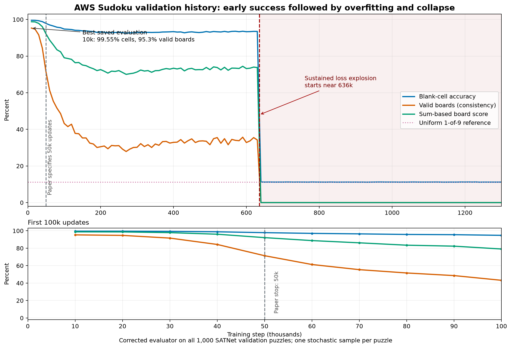

# AWS Sudoku Training Run Report

**Report date:** 30 September 2026  
**Region:** us-east-1  
**Training status:** completed at step 1,300,000; final checkpoint verified  
**Performance verdict:** strong early diagnostic performance, followed by a widening generalization gap and numerical collapse

**Next-run guide:** [IRED Sudoku on AWS - Run Retrospective and Next-Run Playbook](output/pdf/IRED_Sudoku_AWS_Next_Run_Playbook.pdf)

## Executive summary

The AWS run reached its planned 1.3 million training steps and wrote the final checkpoint, `results/ds_sudoku/model_sudoku_diffsteps_10/model-1300.pt`. A follow-up evaluation of 256 held-out SATNet puzzles measured only **11.1164% accuracy on blank cells**, **0% fully consistent Sudoku boards**, and a **0% SAT-Net board score**. That final checkpoint was effectively at the 1-in-9 uniform-guess reference.

The recovered training journal changes the diagnosis: the model **did learn successfully at first**. At step 10,000 it reached **99.5534% blank-cell accuracy** and **95.3% strict valid-board consistency** across all 1,000 SATNet test puzzles. The direct exact-grid solve rate was not logged, and the paper does not clearly map its reported 99.4% to the released metrics. Test performance then declined while the sampled training batch remained at 100%, showing a widening generalization gap consistent with severe overfitting. Near step 636,102 the loss rose above `1e20`; by step 640,000 performance was at chance and never recovered. The launcher continued because it had no early stopping, best-checkpoint retention, or divergence guard.

The run was not a reproduction of the paper's optimization protocol. The paper specifies 50,000 updates on one RTX 2080 with a total batch of 64 and Adam at `1e-4`. The AWS launcher used 1.3 million updates on eight A100s with 64 examples per process, making the total batch 512 at the same learning rate. It made 26 times as many optimizer updates and presented about 208 times as many training examples as the paper. The early peak occurred near comparable sample exposure, and prolonged optimization preceded the degradation and collapse; no controlled batch or schedule ablation has isolated their individual effects.

The training host was a `p4d.24xlarge` Spot instance with eight A100 GPUs. Cost Explorer recorded **45.198333 Spot instance-hours** and **$824.41 gross p4d compute charges**. Credits exactly offset the recorded p4d charges. The original instance is stopped, but its 100 GB EBS root volume remains attached, so storage charges can continue after this report's billing cutoff.

## Run and hardware

The job followed the repository's AWS Sudoku launcher: 1.3 million total steps, batch size 64 per GPU, 10 diffusion steps, energy-landscape supervision, inner-loop optimization, four data workers, and validation every 10,000 steps. It resumed from the local step-2,000 checkpoint. The 18,000-puzzle RRN evaluation was explicitly skipped during training.

| Workload | AWS host | Hardware and role |
|---|---|---|
| Main training | `p4d.24xlarge` Spot, us-east-1c | 8 NVIDIA A100 40 GB GPUs, 96 vCPUs, 1,152 GiB RAM; encrypted 100 GB gp3 root volume (3,000 IOPS, 125 MB/s). [AWS p4d specifications](https://docs.aws.amazon.com/ec2/latest/instancetypes/ac.html) |
| Initial validation attempt | `m7i.xlarge` On-Demand | 4 vCPUs, 16 GiB RAM; CPU evaluation was too slow to finish in the available validation window. [AWS M7i specifications](https://aws.amazon.com/ec2/instance-types/general-purpose/) |
| Final validation | `g4dn.xlarge` On-Demand | 1 NVIDIA T4 GPU, 4 vCPUs, 16 GiB RAM; completed the 256-puzzle GPU evaluation. [AWS G4 specifications](https://aws.amazon.com/ec2/instance-types/g4/) |

The p4d launched at 08:36 UTC on 27 September. Its Spot usage ended after the target checkpoint was reached, before the configured 56-hour shutdown deadline. Cost Explorer recorded 45.198333 p4d hours, about 10.8 hours below that deadline.

## Performance evaluation

The final checkpoint was loaded on a temporary validation clone. The test ran four batches covering 256 puzzles from the SATNet test split, which this trainer labels as validation, and exited successfully.

| Metric | Result | Interpretation |
|---|---:|---|
| Blank-cell accuracy | **11.1164%** | Fraction of originally blank cells whose predicted digit matched the solution. A uniform random choice among nine digits is 11.111%; this result is effectively at that reference level. |
| Sudoku consistency | **0%** | No evaluated prediction satisfied the code's strict row, column, and 3×3-box digit uniqueness checks. |
| `board_accuracy` | **0%** | The code's SAT-Net sum-based board score was zero. This is a validity score, not an exact-grid-match rate. |

These are final-checkpoint results, not an estimate from the training loss. The implementation computes cell accuracy over **blank cells only**; givens are excluded. The consistency metric is the clearest evidence here that the model did not return legal complete Sudoku boards.

## Why the result did not match the paper

### The training protocol was materially different

The paper's Appendix A and the AWS run used the following settings:

| Setting | Paper | AWS run | Difference |
|---|---:|---:|---:|
| Optimizer updates | 50,000 | 1,300,000 | 26× more |
| GPUs | 1 RTX 2080 | 8 A100 40 GB | Distributed training |
| Batch per process | 64 | 64 | Same local batch |
| Total batch | 64 | 512 | 8× larger |
| Learning rate | `1e-4` | `1e-4` | No retuning for the larger batch |
| Approximate sample presentations | 3.2 million | 664.704 million* | 207.72× more |
| Fixed training-set equivalents | about 356 | about 73,856* | 207.72× more |

\*The first 2,000 updates ran locally with batch 64; the remaining 1,298,000 used a total batch of 512 on AWS.

The distributed batch change came from launching eight processes with `--batch_size 64 --split-batches False`. The released trainer defaults to `split_batches=True`, which would divide a total batch of 64 across the eight processes. Hardware count alone is not the issue; the launcher changed the optimizer's effective batch and then ran far beyond the paper's stopping point.

With the local first 2,000 updates included, the AWS run reached the paper's 3.2 million sample presentations near step 8,000. Its best validation was recorded at step 10,000, after about 4.224 million presentations. By step 50,000 it had already processed about 7.72 times the paper's total examples. Sample counts do not make the two optimizer trajectories equivalent, but they explain why the useful checkpoint arrived much earlier in update count under the eight-times-larger total batch.

### The model learned, overfit, and then numerically collapsed

The recovered system journal contains corrected full-batch metrics for all 1,000 SATNet test puzzles every 10,000 steps. The trainer repeatedly used this paper test split as validation, so the history is diagnostic rather than an unbiased checkpoint-selection record:

| Step | Blank-cell accuracy | Strict consistency | Sum-based `board_accuracy` | State |
|---:|---:|---:|---:|---|
| 10,000 | **99.5534%** | **95.3%** | **98.7593%** | Best recorded validation |
| 20,000 | 99.5244% | 94.7% | 98.6790% | Beginning to decline |
| 50,000 | 97.8427% | 71.4% | 92.1309% | Paper stopping point, but after much more data exposure |
| 100,000 | 94.7650% | 43.2% | 79.0889% | Strong overfitting |
| 200,000 | 93.1972% | 30.5% | 72.6148% | Further degradation |
| 630,000 | 93.4651% | 34.2% | 73.7494% | Last validation before collapse |
| 640,000 | 11.2631% | 0% | 0% | Chance-level collapse |
| 1,300,000 | 11.1937% | 0% | 0% | No recovery |

At every journaled evaluation from step 10,000 through step 630,000, the sampled training batch scored 100% on all three metrics while held-out board consistency fell from 95.3% into the low 30s. This directly establishes overfitting rather than a failed start or a bad dataset.

The collapse was abrupt and visible in the loss:

- At step 636,000, the sampled loss was still `0.0146`.
- The first sustained value above `1e20` appeared around step 636,102.
- At step 637,000, the loss was approximately `8.90e24`; values on the order of `1e24` to `1e25` continued through the end.
- The largest observed journal value was approximately `2.44e25`.

The two final checkpoint files were readable, and all model, EMA, and optimizer tensors were finite. A direct tensor comparison found the online and EMA model parameters in steps 1,299,000 and 1,300,000 to be exactly equal even though optimizer counters advanced. By the final 1,000 steps, training was effectively frozen: the enormous finite loss scale no longer produced representable parameter changes. Gradient clipping was enabled and the weights stayed finite, but there was no loss-excursion stop, learning-rate schedule, or rollback to the best validation checkpoint. The saved artifacts establish when the collapse happened, but do not retain enough gradient-level telemetry to identify its exact numerical trigger.

The rolling two-checkpoint policy then deleted the useful early checkpoints. The run therefore completed operationally while preserving only collapsed models.

### The starting checkpoint was healthy

A separate diagnostic loaded the EMA weights from the local step-2,000 checkpoint and sampled the first eight puzzles from the unchanged SATNet test split with the corrected evaluator. With a fixed seed, it measured **72.7528% blank-cell accuracy**, 0% fully consistent boards, and a 3.0864% sum-based board score. Every sampled output was finite. This small stochastic diagnostic agrees with the recovered journal: training began normally and improved sharply before the recorded test diagnostic peaked at step 10,000.

### The paper and released code are internally inconsistent

Exact reproduction is also blocked by conflicts in the authors' public materials:

- The paper says 50,000 Sudoku updates, while the released `train.py` hardcodes 1.3 million.
- The paper's architecture table specifies a final 3×3 convolution with nine outputs, while the released `SudokuEBM` uses a 1×1 convolution. This run used the released model.
- The released full-validation path passes `samples[-1]` to the metric even though `sample()` returns a batch tensor. That evaluates one prediction against the entire label batch through broadcasting. This fork corrected it to evaluate `samples`; the final 11.1164% result used the corrected path.
- The paper does not clearly map its reported 99.4% to the three metrics emitted by the release. Its SAT-Net comparator's 98.3% is a puzzle solve rate, while the release's metric named `accuracy` is blank-cell accuracy. With givens clamped, strict `consistency` is the closest released measure of solved puzzles; this run peaked at 95.3% and ended at 0%.
- The release provides no dependency lock, random seed, pretrained Sudoku checkpoint, tagged experiment configuration, or multi-run variance.

The SATNet data itself is not the discrepancy. The local tensors contain 10,000 valid one-hot puzzles split 9,000/1,000 by the released loader, with 31–42 givens per puzzle, and every given agrees with its solution. The core public-code settings also match: ten energy landscapes, clue masking, contrastive landscape supervision, and 20 refinement steps per landscape.

## AWS cost record

Cost Explorer was queried on 30 September 2026 at 03:52 UTC. Its daily data was present through 29 September and may lag for later activity. Costs below are USD.

| Cost item | Recorded usage | Gross usage charge | Matching credits | Net recorded |
|---|---:|---:|---:|---:|
| p4d.24xlarge Spot compute | 45.198333 instance-hours | $824.41 | −$824.41 | $0.00 |
| gp3 EBS usage in the account during the run window* | 6.666667 GB-month | $0.53 | −$0.53 | $0.00 |
| Public IPv4 usage in the account during the run window* | 46.2025 address-hours | $0.23 | −$0.23 | $0.00 |
| **Recorded subtotal** |  | **$825.18** | **−$825.18** | **$0.00** |

\* Cost Explorer grouped these EBS and IPv4 amounts by usage type, not by this run's resource IDs, so they are account-level totals for the queried window rather than perfect per-resource attribution. The p4d Spot line is tied to the unique p4d training workload in that window. Credits shown are the actual matching Cost Explorer `Credit` records; this is not a statement about the account's overall bill or remaining credit balance.

The temporary CPU and GPU validation hosts ran for about 36m 38s on `m7i.xlarge` and 10m 39s on `g4dn.xlarge`. Their compute lines had not appeared in Cost Explorer at report time. Using the us-east-1 Linux On-Demand rates effective 1 September 2026 ($0.2016/hour and $0.526/hour, respectively), their estimated compute is **about $0.22 gross** before any credits. This estimate excludes any small delayed EBS, snapshot, or network charges. The temporary clone and validation image/snapshot were cleaned up after the test.

The forensic follow-up used two `t3.xlarge` On-Demand hosts for a combined 24m 4s. At the AWS Price List rate effective 1 September 2026 of $0.1664/hour, their estimated compute is **about $0.07 gross** before credits. The temporary 100 GB clone, snapshot, audit instances, and SSH access rule were deleted after the audit; their small delayed storage and public-IPv4 charges are not yet in Cost Explorer.

The reported training compute cost is substantially below the earlier 56-hour Spot cap of $1,030.40. That cap was a planning ceiling, not a forecast of final total project charges. The p4d's encrypted 100 GB gp3 volume remains attached to the stopped instance, so storage can keep accruing beyond the usage shown above; later billing data may also add validation-host charges.

## Conclusion and pitfalls

- **The model reached a useful early state.** At step 10,000, it reached 99.5534% blank-cell accuracy and 95.3% strict consistency on all 1,000 SATNet test puzzles. That checkpoint should have been retained for diagnosis, but selecting it after repeated test-set inspection would not constitute an unbiased paper result.
- **The final artifact failed because training continued.** Validation overfit for hundreds of thousands of steps, the loss exploded near step 636,102, and the retained final model was at chance.
- **The run did not follow the paper's optimization protocol.** The 26× longer schedule and 8× larger total batch changed the trajectory enough that this is not a reliable reproduction of the paper's reported experiment.
- **The released repository is not sufficient for exact reproduction.** Its training length and architecture disagree with the paper, and its original validation path is incorrect for batched predictions.
- **Training-batch success hid held-out degradation.** Training metrics stayed at 100% while strict validation consistency fell from 95.3% into the low 30s. Checkpoint selection must use held-out boards.
- **The recovered history covers all 1,000 SATNet test puzzles.** The separate final-checkpoint confirmation covered 256 puzzles and agreed with the full journal result. The 18,000-puzzle RRN test and multi-seed evaluation were not run.
- **Chance comparison is only a reference.** 11.111% assumes uniform random choice among nine digits. It is not a measured baseline for this exact subset and does not diagnose why the model failed.
- **The reported `board_accuracy` name can mislead.** In this implementation it is a SAT-Net sum-based validity score, not the proportion of boards exactly equal to the answer. Use it alongside the stricter consistency metric and a direct solved-board rate.
- **The cost record is time-limited and partly account-scoped.** AWS billing data can arrive later, EBS and IPv4 usage were not resource-tagged in this query, and the retained root volume may continue to bill.

For a future attempt, first use a development split carved from the 9,000 training boards to validate metrics, guardrails, and the operating procedure. Then lock the protocol and retrain from scratch on all 9,000 boards using one GPU, global batch 64, Adam `1e-4`, fixed seeds, and the paper's 50,000-update endpoint. Keep the 1,000 SATNet test boards untouched until one final evaluation per seed, with direct exact-grid solve rate as the primary metric. Abort and preserve forensics on non-finite values or a sustained loss excursion. Retain pinned milestones, last-known-good, and final checkpoints off-instance. Run RRN only after configuration selection. An A/B run of the paper's 3×3 final convolution and the release's 1×1 convolution is needed to resolve that architecture conflict.

## Evidence and method

- Repository configuration: `aws/run_sudoku.sh`, `AWS_TRAINING.md`, `sat_dataset.py`, and `diffusion_lib/denoising_diffusion_pytorch_1d.py`.
- AWS checks: EC2 instance/volume and Spot request state; CloudTrail launch/stop/clone events; Cost Explorer usage and `Credit` records; AWS Price List API for the two validation host rates.
- Evaluation results: final step-1,300,000 checkpoint, 256 SATNet test puzzles, four batches; final metrics reported by the repository's Sudoku evaluator.
- Recovered training history: the complete system journal from the stopped p4d root volume, parsed into `aws/sudoku_validation_history.csv`; visualization in `aws/sudoku_validation_curve.png`.
- Checkpoint integrity audit: steps 1,299,000 and 1,300,000 loaded on an isolated temporary host; model, EMA, and optimizer tensors checked for non-finite values and final parameter states compared directly.
- Reproduction comparison: the [IRED paper](https://energy-based-model.github.io/ired/ired.pdf), the authors' [released repository](https://github.com/yilundu/ired_code_release), and the [SATNet paper](https://proceedings.mlr.press/v97/wang19e/wang19e.pdf).
- Local checkpoint diagnostic: EMA at step 2,000, first eight SATNet test puzzles, fixed seed, corrected full-batch metric.
